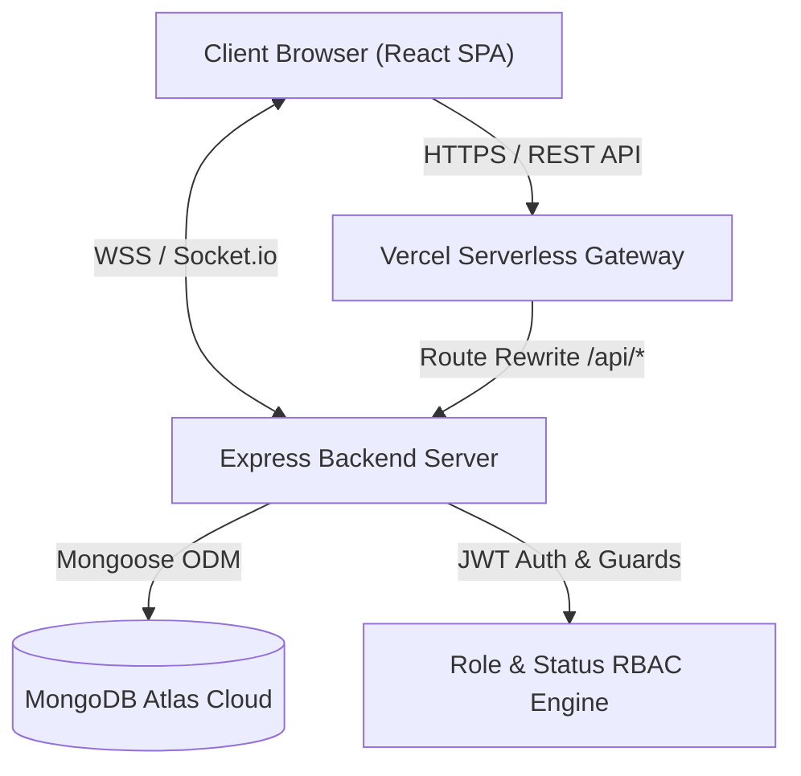
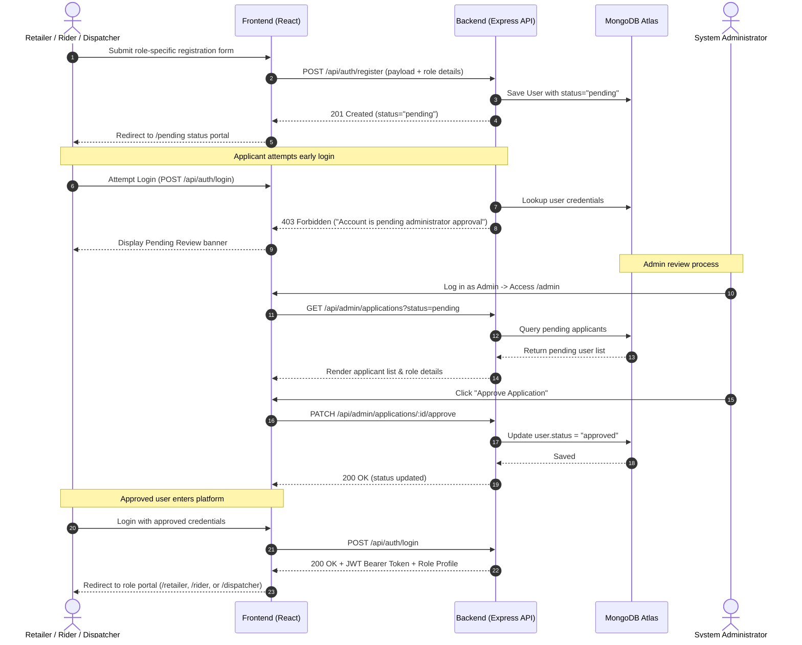
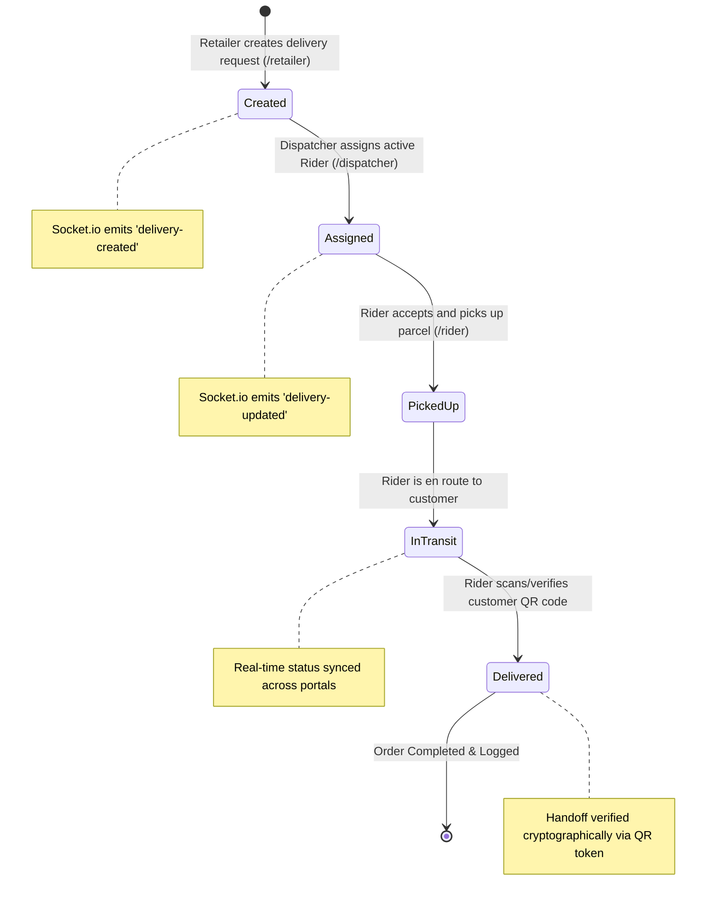
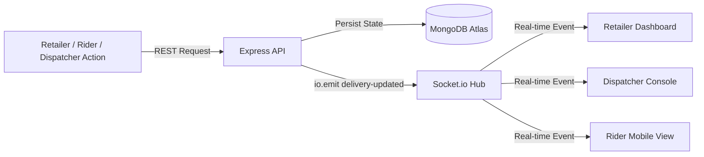

# Reflex — Delivery Tracking & Role-Based Management Platform

Reflex is a delivery tracking and coordination platform built for Kenyan micro, small, and medium retailers. It features a **multi-tiered role-based registration and approval system**, real-time dispatch and delivery tracking with Socket.io, cryptographically unique QR code handoff verification, and dedicated operational portals for every user persona.

---

## 🌐 Live Production Deployment (Vercel)

Both the **Frontend (React SPA)** and **Backend (Express API + Serverless Functions)** are hosted live on Vercel:

- **Application URL:** [https://reflex-app-hazel.vercel.app](https://reflex-app-hazel.vercel.app)
- **Live Backend API Base:** `https://reflex-app-hazel.vercel.app/api`
- **Database:** MongoDB Atlas Cloud (`reflex-cluster.srcq3y7.mongodb.net`)
- **Deployment Monorepo:** [GitHub Repository](https://github.com/elmbondo/reflex-app)

---

## 🏗️ System Design & Workflow Architecture

### 1. System Architecture



Reflex separates concerns into three decoupled tiers:
1. **Presentation Layer (React 18 SPA):** Client-side routing with React Router v6, centralized auth via `AuthContext`, reactive state synchronization with Socket.io-client, and responsive design.
2. **Application & API Layer (Node.js / Express):** Stateless RESTful endpoints, JWT generation and validation, RBAC route guards, status transition state machine, and real-time Socket.io emitter.
3. **Persistence Layer (MongoDB Atlas Cloud):** Schemas for Users (with polymorphic role details), Deliveries (with audit history and QR tokens), and Support Tickets.

---

### 2. User Registration & Admin Approval Workflow



---

### 3. End-to-End Delivery Order Lifecycle



---

### 4. Real-Time Synchronization Pipeline



---

## 👥 User Roles, Personas & Portal Capabilities

| Role | Portal Route | Primary Capabilities | Registration Details Required |
|---|---|---|---|
| **Admin** | `/admin` | • Review, approve, or reject applicants<br>• View system statistics and active accounts<br>• Filter applicants by role and approval status | Pre-seeded system administrator |
| **Retailer** | `/retailer` | • Create new delivery orders<br>• Generate customer QR tokens for secure verification<br>• Live tracking of ongoing and completed parcels | Shop name, physical shop location, business type, phone number |
| **Dispatcher**| `/dispatcher`| • Monitor unassigned delivery pool<br>• View approved, available riders<br>• Assign riders to orders and monitor fleet status | Full name, phone number, operating hub / base address |
| **Rider** | `/rider` | • View assigned delivery tasks<br>• Update delivery status (`Picked Up`, `In Transit`)<br>• Scan / verify customer QR code for final handoff | Motorcycle registration number, chassis/frame number, motorcycle model & color, phone number |

---

## 🔐 Security & Access Control Model (RBAC)

1. **Password Hashing:** Passwords are encrypted using `bcryptjs` with salt rounds (10) before saving.
2. **Stateless JWT Tokens:** Upon successful login, the server issues a signed JSON Web Token containing the user's `id`, `role`, and `status`.
3. **Route Guards (Backend):**
   - `auth`: Validates the `Authorization: Bearer <token>` header.
   - `requireRole(...)`: Validates that the caller holds the authorized persona.
   - `status check`: Enforces that only users with `status === 'approved'` can perform transactional tasks.
4. **Client-Side Route Protection (`ProtectedRoute.js`):**
   - Redirects unauthenticated users to `/login`.
   - Traps pending or rejected users in the `/pending` view.
   - Guards against direct URL manipulation (e.g. a Retailer manually browsing to `/dispatcher`).

---

## 🧪 Test Data & Verified Credentials

The following seeded and automated test accounts are verified to work with the system:

### 1. System Administrator Credentials (Pre-seeded)
- **Email:** `admin@reflex.co.ke`
- **Password:** `Admin@Reflex2026!`
- **Role:** `Admin` (Status: `approved`)

### 2. Sample Approved Operational Test Accounts
| Persona | Email | Password | Role / Sample Details |
|---|---|---|---|
| **Retailer** | `wanjiku@boutique.co.ke` | `RetailerPass123!` | Shop: *Wanjiku Boutique*, Biashara St, Nairobi CBD |
| **Rider** | `kevin@riders.co.ke` | `RiderPass123!` | Reg: *KMDF 500X*, Boxer BM 150 (Solid Red) |
| **Dispatcher**| `sarah@dispatch.co.ke` | `DispatcherPass123!` | Hub: *Reflex Central Hub, Industrial Area* |

### 3. Sample Delivery Request Data
```json
{
  "customerName": "Amina Hassan",
  "customerPhone": "0711998877",
  "address": "Kilimani, Wood Avenue Apt 4B, Nairobi",
  "itemDescription": "1x Designer Handbag (Secure Parcel Box)",
  "currentStatus": "Pending"
}
```

### 4. Sample Support Ticket Data (Public Contact)
```json
{
  "name": "Otieno Odhiambo",
  "phone": "0722000111",
  "issue": "Customer requested an updated delivery ETA for parcel."
}
```

---

## 📁 Repository Directory Structure

```
reflex-app/
├── backend/
│   ├── middleware/
│   │   └── auth.js             # JWT authentication and role authorization guards
│   ├── models/
│   │   ├── Delivery.js         # Delivery order schema with QR token and status trail
│   │   ├── SupportTicket.js    # Public support inquiry schema
│   │   └── User.js             # User account schema with polymorphic role fields
│   ├── routes/
│   │   ├── admin.js            # Admin approval, rejection, applicant listing & stats
│   │   ├── auth.js             # Registration, login, status validation, and /me
│   │   ├── deliveries.js       # Order creation, rider assignment, status & QR verification
│   │   └── support.js          # Public support ticket submission
│   ├── seedAdmin.js            # Admin seeding script with Google DNS resolver fallback
│   ├── server.js               # Express server entry point with Socket.io & MongoDB
│   ├── test_e2e.js             # 23-assertion automated end-to-end test suite
│   ├── package.json            # Backend dependencies & start scripts
│   └── vercel.json             # Backend serverless configuration
├── frontend/
│   ├── public/
│   │   ├── favicon.ico         # Reflex brand icon
│   │   └── index.html          # HTML5 container with Google Fonts & SEO tags
│   ├── src/
│   │   ├── components/
│   │   │   ├── Navigation.js   # Responsive navbar with auth badges & portal navigation
│   │   │   └── ProtectedRoute.js # React Router RBAC and approval status guard
│   │   ├── context/
│   │   │   └── AuthContext.js  # Global authentication context & localStorage persistence
│   │   ├── pages/
│   │   │   ├── About.js        # Company mission, team, and story
│   │   │   ├── AdminView.js    # Admin console with application approval workflow
│   │   │   ├── DispatcherView.js # Dispatcher console with live assignment matrix
│   │   │   ├── FAQs.js         # Frequently asked questions with interactive accordion
│   │   │   ├── HomePage.js     # Marketing landing page with hero CTA & benefits
│   │   │   ├── HowItWorks.js   # Step-by-step role lifecycle guide
│   │   │   ├── LoginView.js    # JWT login form with automatic role redirection
│   │   │   ├── PendingView.js  # Account application status monitor (Pending / Rejected)
│   │   │   ├── RegisterView.js # Multi-step registration form with role-specific fields
│   │   │   ├── RetailerView.js # Retailer delivery creation & live tracking dashboard
│   │   │   ├── RiderView.js    # Rider workflow with QR scanner & status updates
│   │   │   └── SupportView.js  # Public customer support contact form
│   │   ├── api.js              # Axios instance with Bearer token interceptor
│   │   ├── socket.js           # Shared Socket.io WebSocket instance
│   │   ├── App.js              # Client routing configuration
│   │   └── index.css           # Global design system tokens, typography & CSS animations
│   └── package.json            # Frontend dependencies & React build scripts
├── vercel.json                 # Monorepo fullstack rewrite configuration
├── VERCEL_DEPLOYMENT.md        # Comprehensive production deployment manual
└── README.md                   # Project documentation & architecture manual
```

---

## 🔌 API Route Reference Matrix

### Authentication Endpoints (`/api/auth`)
| Method | Endpoint | Description | Auth Required |
|---|---|---|---|
| `POST` | `/api/auth/register` | Register new applicant (Retailer, Rider, Dispatcher) | No |
| `POST` | `/api/auth/login` | Authenticate user; returns JWT token + role payload | No |
| `GET` | `/api/auth/me` | Fetch authenticated user profile and live status | Yes (Bearer) |

### Administrator Endpoints (`/api/admin`)
| Method | Endpoint | Description | Auth Required |
|---|---|---|---|
| `GET` | `/api/admin/applications` | Query all applicants (supports `?status=pending`) | Admin only |
| `PATCH`| `/api/admin/applications/:id/approve` | Approve a pending applicant account | Admin only |
| `PATCH`| `/api/admin/applications/:id/reject` | Reject an applicant account | Admin only |
| `GET` | `/api/admin/stats` | Aggregated metrics for pending, approved, and rejected accounts | Admin only |

### Delivery Management Endpoints (`/api/deliveries`)
| Method | Endpoint | Description | Auth Required |
|---|---|---|---|
| `GET` | `/api/deliveries` | Retrieve deliveries (filterable by `retailerId`, `riderId`) | Yes (Bearer) |
| `POST` | `/api/deliveries` | Create a new delivery order with auto-generated QR code | Yes (Retailer) |
| `PATCH`| `/api/deliveries/:id/assign` | Assign an approved rider to a delivery | Yes (Dispatcher)|
| `PATCH`| `/api/deliveries/:id/status` | Advance status (`Picked Up`, `In Transit`, `Delivered` + QR verification) | Yes (Rider) |
| `GET` | `/api/deliveries/verify/:qrCode`| Verify delivery legitimacy using QR token | No |

### Customer Support Endpoints (`/api/support`)
| Method | Endpoint | Description | Auth Required |
|---|---|---|---|
| `POST` | `/api/support` | Submit a customer support / delivery inquiry ticket | No |

---

## 🚀 Local Development Setup Guide

### Prerequisites
- [Node.js](https://nodejs.org/) (v18 or higher recommended)
- [MongoDB Atlas](https://www.mongodb.com/cloud/atlas) account (or a local MongoDB instance)
- Git

### Step 1: Clone the Repository
```bash
git clone https://github.com/elmbondo/reflex-app.git
cd reflex-app
```

### Step 2: Configure & Start the Backend
```bash
cd backend
npm install
```

Create a `backend/.env` file:
```env
PORT=5000
MONGO_URI=mongodb+srv://<username>:<password>@cluster.mongodb.net/reflex?retryWrites=true&w=majority
JWT_SECRET=your_super_secret_jwt_key_here
```

Seed the default administrator account:
```bash
node seedAdmin.js
```

Start the Express development server:
```bash
npm start
```
*Backend server runs at `http://localhost:5000`*

### Step 3: Configure & Start the Frontend (New Terminal Window)
```bash
cd frontend
npm install
```

Create a `frontend/.env` file:
```env
REACT_APP_API_URL=http://localhost:5000/api
REACT_APP_SOCKET_URL=http://localhost:5000
```

Start the React development server:
```bash
npm start
```
*Frontend application will open automatically at `http://localhost:3000`*

---

## 🧪 Running the Automated End-to-End Test Suite

The repository includes a comprehensive 23-assertion end-to-end verification suite (`backend/test_e2e.js`) that validates the complete system flow:

```bash
cd backend
node test_e2e.js
```

### Test Coverage Highlights:
1. ✅ **Health Check**: Express server responds with 200 OK.
2. ✅ **Admin Login**: Admin signs in with seeded credentials and receives JWT.
3. ✅ **Multi-Role Registration**: Retailer, Rider, and Dispatcher registrations create `status: "pending"` accounts.
4. ✅ **403 Security Enforcement**: Pending and rejected users are strictly prevented from logging into portals.
5. ✅ **Admin Workflow**: Admin queries applications, inspects motorcycle & shop metadata, rejects bad actors, and approves valid users.
6. ✅ **Approved Login**: Approved accounts log in and obtain valid JWT tokens.
7. ✅ **Socket.io Connection & Events**: Real-time WebSocket connection establishes, fires `delivery-created` and `delivery-updated`.
8. ✅ **Delivery Lifecycle**: Retailer creates order → Dispatcher assigns rider → Rider picks up parcel → Rider marks as delivered with QR verification.
9. ✅ **Admin Stats**: Aggregate counts dynamically reflect state changes.
10. ✅ **Support Tickets**: Public inquiries are submitted and persisted with assigned ticket IDs.

---

## 📄 License & Contributing

Built for the Kenyan retail ecosystem. Licensed under the [MIT License](LICENSE).
